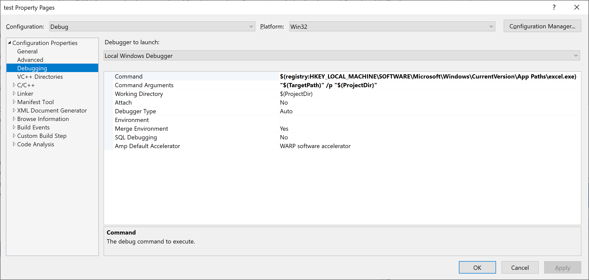

# xll - a library for creating Excel add-ins

This library makes it simple to call C and C++ functions from Excel.
It is much easier to use than the Microsoft
[Excel Software Development Kit](https://docs.microsoft.com/en-us/office/client-developer/excel/welcome-to-the-excel-software-development-kit).

It also provides high performance access to [numeric arrays](#the-fp-data-type) and
[handles](#handles) for embedding C++ objects that use only
[single inheritance](https://docs.microsoft.com/en-us/cpp/cpp/single-inheritance).

## Prerequisites

Windows 10  
  The Excel SDK is not supported on MacOS.

[Visual Studio 2019](https://visualstudio.microsoft.com/)  
  Use the Community Edition and install the `Desktop development with C++` workload.

[Microsoft Excel](https://www.microsoft.com/en-us/microsoft-365/excel)  
  Install the 64-bit version of Office 365 for the best experience.

[Sandcastle Help File Builder](https://github.com/EWSoftware/SHFB)  
  This is optional if you want to create help files integrated into Excel.

## Get Started

Run the [installer](https://github.com/xlladdins/xll/xll.msi). This places
the xll project template in your `Documents\Visual Studio 2019` folder
and include visualizers for debugging.

Create a new project using `File ► New ► Project...` (`Ctrl-Shift-N`) and
select `XLL Project`. You will need to
add a git submodule for `xll`. Run `Tools ► Command Line ► Developer Command Prompt`
from the Visual Studio menu and type

> git submodule add https://github.com/xlladdins/xll.git


Create a new project using `File ► New ► Project...` (`Ctrl-Shift-N`) and
select `XLL Project`. At this point you can compile and run the add-in
using `Debug ► Start Debugging` (`F5`). This compiles the dll, (with
file extension `.xll`), and starts Excel with the add-in loaded.

The program to start and the arguments to use are specified in _project properties_.
Right click on a project and select `Properties` (`Alt-Enter`) at the bottom of the 
popup menu.
Navigate to `Debugging` in `Configuration Properties`.



The `Command` `$(registry:HKEY_LOCAL_MACHINE\SOFTWARE\Microsoft\Windows\CurrentVersion\App Paths\excel.exe)`
looks in the registry for the full path of the Excel executable.
The `Command Arguments` `"$(TargetPath)" /p "$(ProjectDir)"` are passed to
Excel when the debugger starts. The variable `$(TargetPath)` is the
full path to the xll that was built and is opened by Excel. 
The `/p` flag to Excel sets the
default directory so `Ctrl-O` opens to the project directory.

## Add-in Functions

To register a C/C++ function that can be called from Excel create
an `AddIn` object that has information Excel requires.

```C++
#include <cmath>
// Uncomment to build for versions of Excel prior to 2007.
// #define XLOPERX XLOPER
#include "xll/xll.h"

using namespace xll;

AddInX xai_tgamma(
    FunctionX(XLL_DOUBLEX, X_("?xll_tgamma"), X_("TGAMMA"))
    .Args({
        ArgX(XLL_DOUBLEX, X_("x"), X_("is the value for which you want to calculate Gamma."))
    })
    .FunctionHelp(X_("Return the Gamma function value."))
    .Category(X_("Cmath"))
    .HelpTopic(X_("https://docs.microsoft.com/en-us/cpp/c-runtime-library/reference/tgamma-tgammaf-tgammal!0"))
);
double WINAPI xll_tgamma(double x)
{
#pragma XLLEXPORT
    return tgamma(x);
}
```

The add-in registers the function `TGAMMA` with Excel to call the C++ function
`xll_tgamma` that returns a `double`. It has one argument that
is also a `double` and will show up in the Excel function wizard under the
`Cmath` category with the specified function help.
When 
[Help on this function](https://docs.microsoft.com/en-us/cpp/c-runtime-library/reference/tgamma-tgammaf-tgammal)
is clicked it will open the help topic for the Microsoft documentation of `tgamma`.


Compare this to
the built-in Excel functon 
[`GAMMA`](https://support.microsoft.com/en-us/office/gamma-function-ce1702b1-cf55-471d-8307-f83be0fc5297).


All functions called from Excel must be declared
with `WINAPI` which is defined to be [`__stdcall`](https://docs.microsoft.com/en-us/cpp/cpp/stdcall).
This is an artifact of the original versions of Excel being written in Pascal.
The line `#pragma XLLEXPORT` causes the function to be exported
from the dll so it will be visible to Excel. 
No need for old-fashioned `.DEF` files.

The function `xll_tgamma` calls the `tgamma` function declared in 
the `<cmath>` library. 
Recall the Gamma function is 
<math><i>&Gamma;(x) = &int;<sub>0</sub><sup>&infin;</sup> 
t<sup>x - 1</sup> e<sup>-t</sup>&nbsp;dt</i></math>, <math>x > 0</math>. 
It satisfies <math>&Gamma;(x + 1) = x &Gamma;(x)</math>
for <math>x > 0</math>. Since <math>&Gamma;(1) = 1</math> we have
<math>&Gamma;(x + 1) = x!</math>
if <math>x</math> is a non-negative integer.

## The `X` Suffix

The Excel SDK has two versions of most data types, one for pre 2007 Excel and one for post 2007 Excel.
The post 2007 verions allow for large grids and wide character Unicode strings. The new data types
have names with the suffix `12`. This library uses the suffix `X` to make it possible to
write add-ins that work with all version of Excel. 

This is controlled by the macro `XLOPERX`.
Define it to be `XLOPER` for pre 2007 Excel and `XLOPER12` for post 2007 Excel before including `xll/xll.h`.
By default it is defined to be `XLOPER12`. Use the macro `X_` to create strings of the appropriate type.
E.g., `X_("foo")` is either `"foo"` or `L"foo"` depending on the type of `XLOPERX`. 

## The FP Data Type

The `FP` data type is a two dimensional array of floating point numbers. It is
the fastest way of interacting with numerical data in Excel. All other APIs
require the data to be copied.
It is
defined in [`XLCALL.H`](xll/XLCALL.H)
for versions of Excel prior to 2007 as
```C
typedef struct _FP
{
    unsigned short int rows;
    unsigned short int columns;
    double array[1];        /* Actually, array[rows][columns] */
} FP;

```
and for versions after 2007 as
```C
typedef struct _FP12
{
    signed int rows;
    signed int columns;
    double array[1];        /* Actually, array[rows][columns] */
} FP12;
```

The classes `xll::FP` and `xll::FP12` make these into well-behaved
[C++ value types](https://docs.microsoft.com/en-us/cpp/cpp/value-types-modern-cpp).
Use `_FPX` to get the appropriate raw Excel type to use for arguments and
return type. Excel doesn't know about anything in the `xll` namespace.'

Use `xll::FPX a(2,3)` to create a 2 by 3 array of `OPERX` and `a(1,0)` access
the second row, first column (indexing is 0-based) of `a`. The same element
can be accessed using one-dimesional indexing via `a[3]` since data are 
stored in row-major order. Use the member function `resize` to resize the array.

The `FPX` data type also has member functions for `rows`, `columns`, and `size`.
To be STL friendly the member functions `begin` and `end` are provided for
both `const` and non-const iterators over array elements.

## Handles

Handles are used to access C++ objects in Excel. 
Call `xll::handle<T> h(new T(...))`
to create a handle to an object of type `T` from any constructor.
If the cell a function is being called from contains a handle from
a previous call
then `delete` is called on the corresponding C++ object.

Use `h.ptr()` to get the underlying C++ pointer and `h.get()` to get 
the handle to be returned to Excel. This has type `HANDLEX` and
is specified in add-in arguments as `XLL_HANDLEX`.

To access a handle use `xll::handle<T> h(handle);`.
This converts  `HANDLEX handle` to a pointer an ensures it
was created as described above.
If the handle is not found the pointer is set to `nullptr`.

The `xll::handle` class has a member function `operator->()` so
`h->member(...)` works as if `h` were a `T*`.

For example if we have the class
```C++
class base {
    OPERX x;
public:
    base(const OPERX& x) : x(x) { }
    OPERX& get() { return x; }
};
```
then we can embed `base` objects in Excel using
```C++
AddInX xai_base(
    FunctionX(XLL_HANDLEX, X_("?xll_base"), X_("XLL.BASE"))
    .Args({
        ArgX({ XLL_LPOPERX, X_("x"), X_("is a cell or range of cells") })
    })
    .FunctionHelp(X_("Return a handle to a base object."))
    .Uncalced() // Required for functions creating handles!!!
);
HANDLEX WINAPI xll_base(LPOPERX px)
{
#pragma XLLEXPORT
    xll::handle h(new base(*px));

    return h.get();
}
```
and access them with
```C++
AddInX xai_base_get(
    FunctionX(XLL_LPOPERX, X_("?xll_base_get"), X_("XLL.BASE.GET"))
    .Args({
        ArgX({ XLL_HANDLEX, X_("handle"), X_("is a handle returned by XLL.BASE") })
    })
    .FunctionHelp(X_("Return the value stored in base."))
);
LPOPERX WINAPI xll_base_get(HANDLEX _h)
{
#pragma XLLEXPORT
    xll::handle<base> h(_h);

    return &h->get();
}
```
For a production quality version of this example see [handle.cpp](test/handle.cpp).
That file also has examples illustrating how single inheritance can be used in Excel.

## [Excel 4 Macro Functions](docs/Excel4Macros/README.md)

Any Excel function can be called with `ExcelX` by using _function numbers_. The
function numbers are defined in `XLCALL.H` and correspond to Excel built-in
functions or macros (command equivalents).
Function numbers starting with `xlf` are functions and can only be called from add-in functions.
Function numbers starting with `xlc` are macros and can only be called from add-in macros.
[Some](https://docs.microsoft.com/en-us/office/client-developer/excel/c-api-functions-that-can-be-called-only-from-a-dll-or-xll)
function numbers are special to the C API. For example, [`xlUDF`](https://docs.microsoft.com/en-us/office/client-developer/excel/xludf)
can be used to call VBA user-defined functions.

## Remarks

This section contains miscellaneous remarks.

### Uncalced

Functions that are declared `.Uncalced()` have a limited ability to call command equivalents.