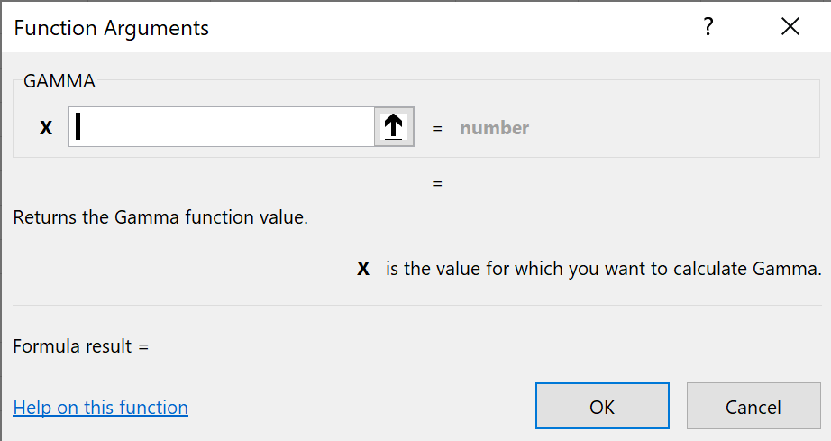

# xll - a library for creating Excel add-ins

This library makes it simple to call C++ functions and macros from Excel.
It is much easier to use than the Microsoft
[Excel Software Development Kit](https://docs.microsoft.com/en-us/office/client-developer/excel/welcome-to-the-excel-software-development-kit).

The major usability enhancement is strings are now UTF-8. They are a L"ot" nicer to use than wide character strings.
We still provides high performance access to [numeric arrays](#the-fp-data-type) and have
[handles](#handles) for embedding C++ objects that can use
[single inheritance](https://docs.microsoft.com/en-us/cpp/cpp/single-inheritance)
to simplify interfaces.

## Prerequisites

[Windows 10](https://www.microsoft.com/en-us/software-download/windows10)  
  The Excel SDK is not supported on MacOS.

[Visual Studio 2019](https://visualstudio.microsoft.com/)  
  Use the Community Edition and install the `Desktop development with C++` workload.

[Microsoft Excel](https://www.microsoft.com/en-us/microsoft-365/excel)  
  Install the 64-bit version of ~~Office~~ Microsoft 365 for the best experience.

## Get Started

Run the [installer](https://xladdins.com/xll.msi). Save the `xll.msi` file and open it.
You will see a popup claiming 
<span title="Where by 'protect' Microsoft means they now require an Extended Validation certificate to extract more money out of software providers.">
'Windows protected your PC'</span> and a link to 'More info'.
That link should show you `xll.msi` was signed by Publisher KALX, LLC. Run anyway.

This places the xll project template in your `Documents\Visual Studio 2019` folder 
and include visualizers for debugging.

Create a new project using `File ► New ► Project...` (`Ctrl-Shift-N`) and select `xllproject`. 
You will need to add a git submodule for `xll` because Visual Studio doesn't know about submodules.
Run `Tools ► Command Line ► Developer Command Prompt`
from the Visual Studio menu and add a [submodule](https://github.blog/2016-02-01-working-with-submodules/).

> `git init`  
> `git submodule add https://github.com/xlladdins/xll.git`  

Copy the debugger setup from `xll\test`.

> `copy xll\test\test.vcxproj.user %projectname%.vcxproj.user`

Where `%projectname%` is the name of the project you created.
These steps can be perfomed by running the `setup.bat` in your project folder.
Type `type setup.bat` from the command prompt to see what will be executed
and `.\setup.bat` to run them.

In Solution Explorer right click on the Solution and add `xll.vcxproj` from the `xll` subfolder
of your project folder using Add ► Existing Project...
At this point you can compile and run the add-in[1]
using `Debug ► Start Debugging` (`F5`). This compiles the dll, (with
file extension `.xll`), and starts Excel with the add-in loaded.

The git repository you created has a snapshot of the xll library at the time you add it as a submodule.
Your copy of the xll submodule will not change if the original xll repository changes.
To get the latest copy start a Developer Command Prompt and pull.

> `cd xll`  
> `git pull`  

[1] You may have to restart Visual Studio to have it recognize the `.user` file.

The program that the debugger starts and the arguments to use are specified in _project properties_.
Right click on a project and select `Properties` (`Alt-Enter`) at the bottom of the popup menu.
Navigate to `Debugging` in `Configuration Properties`.


The `Command` `$(registry:HKEY_LOCAL_MACHINE\SOFTWARE\Microsoft\Windows\CurrentVersion\App Paths\excel.exe)`
looks in the registry for the full path of the Excel executable.
The `Command Arguments` `"$(TargetPath)" /p "$(ProjectDir)"` are passed to
Excel when the debugger starts. The variable `$(TargetPath)` is the
full path to the xll that was built and is opened by Excel. 
The `/p` flag to Excel sets the
default directory so `Ctrl-O` opens to the project directory.


## AddIn

The `xll::AddIn` class is used register Excel functions and macros.
`AddIn` objects should be defined at the 
[global scope](https://docs.microsoft.com/en-us/cpp/cpp/scope-visual-cpp)
so they will be 
[constructed](https://docs.microsoft.com/en-us/cpp/build/run-time-library-behavior)
when the xll is loaded. The contructors store information Excel needs when
[`xlAutoOpen`](https://docs.microsoft.com/en-us/office/client-developer/excel/xlautoopen)
is called. 
The xll library 
[implements](https://github.com/xlladdins/xll/blob/master/xll/auto.cpp#L8)
this for you.

### Function

To register a new C++ add-in function that can be called from Excel create
an `AddIn` object with a `Function` argument that has information Excel needs to register your
_function_: the return type, the C++ function name, the Excel name, and
a list of _arguments_ with their type, name, and short description.
You can optionally specify _function help_ for the Function Wizard and
the _category_ Excel should use.
If you have documentation available at a URL then
provide a link to a _help topic_.

This library uses [UTF-8](http://www.utf-8.com/) instead of multibyte character sets and 
[Unicode](https://docs.microsoft.com/en-us/windows/win32/learnwin32/working-with-strings#unicode-and-ansi-functions)
(UTF-16, UCS-2). 
The Unicode wars are over, the dust has settled, and
UTF-8 is the clear winner. 
[Joel](https://www.joelonsoftware.com/2003/10/08/the-absolute-minimum-every-software-developer-absolutely-positively-must-know-about-unicode-and-character-sets-no-excuses/)
can get you up to speed.

```C++
#include <cmath>
// Uncomment to build for versions of Excel prior to 2007.
// #define XLOPERX XLOPER
#include "xll/xll.h"

using namespace xll;

AddIn xai_tgamma(
    Function(XLL_DOUBLE, "xll_tgamma", "TGAMMA")
    .Arguments({
        Arg(XLL_DOUBLE, "x", "is the value for which you want to calculate Gamma.")
    })
    .FunctionHelp("Return the Gamma function value.")
    .Category("CMATH")
    .HelpTopic("https://docs.microsoft.com/en-us/cpp/c-runtime-library/reference/tgamma-tgammaf-tgammal")
);
double WINAPI xll_tgamma(double x)
{
#pragma XLLEXPORT
    return tgamma(x);
}
```

The add-in registers the function `TGAMMA` with Excel to call the C++ function
`xll_tgamma` that returns a `double`. It has one argument that
is also a `double` and will show up in the Excel function wizard under the
`CMATH` category with the specified function help. When 
[Help on this function](https://docs.microsoft.com/en-us/cpp/c-runtime-library/reference/tgamma-tgammaf-tgammal)
is clicked it will open the help topic for the Microsoft C runtime library reference for `tgamma`.


Compare this to
the built-in Excel functon 
[`GAMMA`](https://support.microsoft.com/en-us/office/gamma-function-ce1702b1-cf55-471d-8307-f83be0fc5297).



_All functions called from Excel must be declared with_ `WINAPI` which is defined to be 
[`__stdcall`](https://docs.microsoft.com/en-us/cpp/cpp/stdcall).
This is an artifact of the original versions of Excel being written in Pascal.
The line `#pragma XLLEXPORT` causes the function to be exported
from the dll so it will be visible to Excel. 
No need for old-fashioned `.DEF` files.

The function `xll_tgamma` calls the `tgamma` function declared in the `<cmath>` library. 
Recall the Gamma function is <math>&Gamma;(x) 
= &int;<sub>0</sub><sup>&infin;</sup> t<sup>x - 1</sup> e<sup>-t</sup>&nbsp;dt</math>,
<math>x > 0</math>. 
It satisfies <math>&Gamma;(x + 1) = x &Gamma;(x)</math> for <math>x > 0</math>. 
Since <math>&Gamma;(1) = 1</math> we have <math>&Gamma;(x + 1) = x!</math> if <math>x</math> is a non-negative integer.
For applications you may want to use the 
[lgamma](https://docs.microsoft.com/en-us/cpp/c-runtime-library/reference/lgamma-lgammaf-lgammal?view=vs-2019)
function that returns the natual logarithm of <math>&Gamma;</math>. For <math>x &ge; 171.62</math>,
<math>&Gamma;(x)</math> is greater than the largest IEEE 64-bit double value. 

### Macro

To register a new add-in _macro_ call `AddIn` with a `Macro` argument. It takes
two string arguments: the name of the C++ function to be called and the name for Excel to use.
Macro functions take no arguments and return an `int` that is non-zero if it succeeds or zero if it fails.
Don't forget `WINAPI` in the function definition 
and `#pragma XLLEXPORT` in the function body so Excel can load it.

```C++
AddIn xai_macro(Macro("xll_macro", "XLL.MACRO"));
int WINAPI xll_macro(void)
{
#pragma XLLEXPORT
    Excel(xlcAlert, 
        Excel(xlfConcatenate,
            OPER("XLL.MACRO called with active cell: "),
            Excel(xlfReftext, 
                Excel(xlfActiveCell), 
                OPER(true) // A1 style instead of R1C1
            )
        ),
        OPER(2), // general information
        OPER("https://xlladdins.github.io/Excel4Macros/alert.html!0")
    );
	
    return TRUE;
}
```

The `Help` button in the alert dialog will take you to documentation for the 
[`ALERT`](https://xlladdins.github.io/Excel4Macros/alert.html) macro.

The name of the `AddIn` object is arbitrary. I use `xai_` as a prefix for all
E&zwnj;__x__&zwnj;cel __a__&zwnj;dd-&zwnj;__i__&zwnj;n objects as a convention. 


### The `4` and `12` Suffixes

The Excel SDK has two versions of most data types, ones for pre 2007 Excel and ones for 2007 Excel and later.
The new verions allow for large grids and wide character Unicode strings. The new data types
have names with the suffix `12`. This library makes it possible to
write add-ins that work with all version of Excel. It uses a technique similar to  the Windows
[`TCHAR`](https://docs.microsoft.com/en-us/windows/win32/learnwin32/working-with-strings) technique.
That uses the suffix `A` for char (ANSI) functions and the `W` suffix for wide character (Unicode) functions. 
When the suffix is omitted the appropriate function will be called based on macros set before including `<tchar.h>`.
The major difference is that the generic functions always take UTF-8 strings.
The xll library converts these to the appropriate string types for Excel.

The xll library controls this by the macro `XLOPERX`.
Define it to be 
[`XLOPER`](https://github.com/xlladdins/xll/blob/master/xll/XLCALL.H#L118) 
for pre 2007 Excel and 
[`XLOPER12`](https://github.com/xlladdins/xll/blob/master/xll/XLCALL.H#L180) 
for Excel 2007 and later before including `xll/xll.h`.
By default it is defined to be `XLOPER12`.
There is no `XLOPER4`.
The file
[`traits.h`](https://github.com/xlladdins/xll/blob/master/xll/traits.h)
uses the [traits pattern](https://accu.org/index.php/journals/442)
to parameterize by these two types.

The SDK uses `Excel4` (or `Excel4v`) and `Excel12` (or `Excel12v`) to 
[call Excel functions](https://docs.microsoft.com/en-us/office/client-developer/excel/calling-into-excel-from-the-dll-or-xll)
from your add-in. We use `AddIn4` and and `AddIn12` to create add-ins for a particular version of Excel if needed.
You can use `AddIn` and let `XLOPERX` control the version. If you need to know the Excel
version at runtime call 
[`XLCallVer`](https://docs.microsoft.com/en-us/office/client-developer/excel/calling-into-excel-from-the-dll-or-xll#xlcallver).
It returns `0x500` (oddly enough) for version 4 and `0x0c00` for version 12 (hexidecimal `C`).

Note the original SDK used `Excel4` and `Excel4v` but not `XLOPER4`. Hmmm.

You can get finer grained information by calling the 
[`GET.WORKSPACE`](https://xlladdins.github.io/Excel4Macros/get.workspace.html)
function with argument `2`. The return value is a string, for example `"5.0"`, with the exact version of Excel.
Using the SDK the call would be `Excel4(xlfGetWorkspace, &version, 1, &two)` where `version` and `two`
are `XLOPER`s with `two = {.val = {.int = 2}, .xltype = xltypeInt}`. You must call
`Excel4(xlFree, 0, 1, &version)` to release the memory Excel allocated for the version string.
Using the xll add-in library the call would be `OPER version = Excel(xlfWorkspace, OPER(2))`.
The destructor for `version` will release the memory when it goes out of scope.

### Excel Data Types

Excel knows about booleans, floating point doubles, various kinds of integers, and null terminated strings. 
These are indicated by, `XLL_BOOL`, `XLL_DOUBLE`, `XLL_SHORT`, ..., `XLL_LONG`, and `XLL_CSTRING`. 
Excel uses _counted strings_ (`XLL_PSTRING`) internally where the first character is the length of the following
string characters.

A _cell_ (or a 2-dimensional row-major range of cells) corresponds to the `OPER` type
defined in the `xll` namespace. It is a _variant_
type that can be a number, string, boolean, reference, error, multi (if it is a range), missing,
nil, simple reference, or integer. The `xltype` member indicates the type and can be one of
`xltypeNum`, `xltypeStr`, `xltypeBool`, `xltypeRef`, `xltypeErr`, `xltypeMulti`, `xltypeMissing`,
`xltypeNil`, `xltypeSRef`, or `xltypeInt`. Although C++ is strongly typed the `OPER` class is designed
to behave much like a cell in a spreadsheet. E.g., `OPER o = 1.23` results in `o.xltype == xltypeNum`
and `o.val.num == 1.23`. Assigning a string `o = "foo"` results in a counted string with
`o.xltype == xltypeStr` and `o.val.str == "\03foo" (== {3, 'f', 'o', 'o')})`. The C++ class for
`OPER` takes care of all memory managment so it acts like a built-in type. If it doesn't
'do the right thing' when you use it let me know because that would be a design flaw on my part.

`OPER`s are specializations of the [`XOPER`](https://github.com/xlladdins/xll/blob/master/xll/oper.h#L27) 
class which publicly inherits from the `XLOPERX` struct defined the header file
[`XLCALL.H`](https://github.com/xlladdins/xll/blob/master/xll/XLCALL.H). More precisely,
`OPER4` inherits from [`XLOPER`](https://github.com/xlladdins/xll/blob/master/xll/XLCALL.H#L118)
and `OPER12` inherits from [`XLOPER12`](https://github.com/xlladdins/xll/blob/master/xll/XLCALL.H#L180). These are shorthand for
`XOPER<XLOPER>` and `XOPER<XLOPER12>`.
This permits an`OPER` to be used anywhere a `const XLOPERX&` can be used. 
The Excel SDK structs know nothing about memory management so the `OPER` constructors make
a copy of the data from a `XLOPERX`.

It is permissable to have multis that contain other multis and can be nested to any depth. 
Multis having two columns with the first column containg strings are quite similar to 
[JSON objects](http://www.json.org/json-en.html). 
You can use the Excel built-in function 
[`DGET`](https://support.microsoft.com/en-us/office/dget-function-455568bf-4eef-45f7-90f0-ec250d00892e) 
to access values via `DGET(multi, 2, key)` to obtain the value (in columns 2) of the `multi` corresponding
to `key`.

The default constructer of `OPER` creates an object of type `xltypeNil`. 
Do not confuse this with the `"#NULL!"` error type that indicates an empty intersection of two ranges. 
The `OPER` `Nil` is predefined. 
Use `Nil4` for the `XLOPER` version and `Nil12` for a `XLOPER12`.

All standard error types are predefined with names corresponding to the error. 
For example, `ErrNull` is the `OPER` with `xltype = xltypeErr` and `val.err == xltypeNull`. 
Both `ErrNull4` and `ErrNull12` are also predefined.

The missing type is used only for function arguments. 
It indicates no argument was provided by the calling Excel function. 
This is predefined as `Missing`,`Missing4` and `Missing12`.
It is an error to return this type from a function. 

### FP Data Type

The [`xll::FPX`](https://github.com/xlladdins/xll/blob/master/xll/fp.h) 
data type is a two dimensional array of floating point numbers. 
It is the fastest way of interacting with numerical data in Excel. 
All other APIs require the data to be copied out of Excel then back again. 
See [potrf.cpp](https://github.com/keithalewis/xlllapack/blob/master/potrf.cpp)
for an example of how to use this. 
It calls the FORTRAN function `DPOTRF` from the 
[LAPACK](http://performance.netlib.org/lapack/) 
library to perform a Cholesky decomposition.(Yes, you can easily call FORTRAN, and C of course, from C++). 
A 1000 x 1000 matrix takes about 0.3 seconds on my old Surface Pro 4 1GHz laptop.

There are structs defined in [`XLCALL.H`](https://github.com/xlladdins/xll/blob/master/xll/XLCALL.H)
for versions of Excel prior to 2007 as [`struct _FP`](https://github.com/xlladdins/xll/blob/master/xll/XLCALL.H#L96)
and [`struct _FP12`](https://github.com/xlladdins/xll/blob/master/xll/XLCALL.H#L109) for later versions.
These are typedef'd as `FP` and `FP12` and reside in the global namespace.

The classes `xll::FP4` and `xll::FP12` make these into well-behaved
[C++ value types](https://docs.microsoft.com/en-us/cpp/cpp/value-types-modern-cpp).
Use `_FPX` (or `_FP4`/`_FP12`) to get the appropriate C Excel type in the global
namespace to use for arguments and
return types. Excel doesn't know about anything in the `xll` namespace.

Since `FPX` does **not** inherit from the C structs you must use
the `FPX::get()` member function to get a pointer to the underlying struct.
This is used to return arrays to Excel where the return type is
`XLL_FPX`. Since you are returning a pointer you must make sure the memory
at which it points continues to exist after the function returns. Typically
this is done by declaring a `static xll::FPX` in the function body.

Use `xll::FPX a(2,3)` to create a 2 by 3 array of doubles and `a(1,0)` to access
the second row, first column (indexing is 0-based) of `a`. The same element
can be accessed using one-dimesional indexing via `a[3]` since data are 
stored in row-major order. Use the member function `resize` to resize the array.

The `FPX` data type also has member functions for `rows`, `columns`, and `size`.
To be STL friendly the member functions `begin` and `end` are provided for
both `const` and non-const iterators over array elements.

## Handle

Handles are used to embed C++ objects in Excel. 
Call `xll::handle<T>(T*)` using `new` to create an object of type `T`.
The call `xll::handle<T> h(new T(...))` creates a handle `h` to 
an object of type `T` using any constructor for `T`.
If the cell a function is being called from contains a handle returned by
a previous call, then the correspoding C++ object is `delete`d 
and the new handle is returned to the cell. 

Use `h.ptr()` to get the underlying C++ pointer and `h.get()` to get 
the handle to be returned to Excel. The latter has type `HANDLEX` and
is specified in add-in arguments as `XLL_HANDLEX`.

To access a handle that has been created use `xll::handle<T>(HANDLEX);`
to converts a handle to a pointer. If the pointer was not created by
a call to `handle<T>(T*)` then it is set to `nullptr` and the value of `h.get()` is the
double 0.

The `xll::handle` class has a member function `operator->()` so
`h->member(...)` works as if `h` were a `T*`.

For example if we have the class
```C++
class base {
    OPER x;
public:
    base(const OPER& x) : x(x) { }
    OPER& get() { return x; }
};
```
then we can embed `base` objects in Excel using
```C++
AddIn xai_base(
    Function(XLL_HANDLEX, "?xll_base", "XLL.BASE")
    .Arguments({
        Arg(XLL_LPOPER, "x", "is a cell or range of cells")
    })
    .FunctionHelp("Return a handle to a base object.")
    .Uncalced() // Required for functions creating handles!!!
);
HANDLEX WINAPI xll_base(LPOPERX px)
{
#pragma XLLEXPORT
    xll::handle<base> h(new base(*px));

    return h.get();
}
```
and access them with
```C++
AddIn xai_base_get(
    Function(XLL_LPOPER, "?xll_base_get", "XLL.BASE.GET")
    .Arguments({
        Arg(XLL_HANDLEX, "handle", "is a handle returned by XLL.BASE")
    })
    .FunctionHelp("Return the value stored in base.")
);
LPOPERX WINAPI xll_base_get(HANDLEX _h)
{
#pragma XLLEXPORT
    static OPER result; // must be static since we are returning its address
    xll::handle<base> h(_h);

    if (h) {
        result = h->get();
    }
    else {
        result = ErrNA;
    }

    return &result;
}
```
For a production quality version of this example see 
[handle.cpp](https://github.com/xlladdins/xll/blob/master/test/handle.cpp).
That file also has examples illustrating how single inheritance can be used in Excel
using `dynamic_cast`.

When a spreadsheet containing handles is reopened you must 'refresh' the handles using `Ctrl-Alt-F9`. 
The old handles that were previously saved are stale.

## [Excel4 Macro Function](https://xlladdins.github.io/Excel4Macros/)

Add-ins can call any Excel function using `xll::Excel` and the appropriate _function number_. 
The function numbers are defined in 
[`XLCALL.H`](https://github.com/xlladdins/xll/blob/master/xll/XLCALL.H) 
and correspond to Excel built-in functions or macros (command equivalents).
To determine the approriate arguments for a function number see the
[Excel 4 Macro documentaton](https://xlladdins.github.io/Excel4Macros/)

Function numbers starting with `xlf` are __f__&zwnj;unctions and can be called from add-in functions.
Function numbers starting with `xlc` are ma&zwnj;__c__&zwnj;ros and can only be called from add-in macros.
Functions are not allowed to have side-effects, they must be purely functional. Macros can only
have side-effects, they take no arguments and return `TRUE` if they run successfully and
`FALSE` if not.

[Some](https://docs.microsoft.com/en-us/office/client-developer/excel/c-api-functions-that-can-be-called-only-from-a-dll-or-xll)
function numbers are special to the C API. 
For example, [`xlUDF`](https://docs.microsoft.com/en-us/office/client-developer/excel/xludf)
can be used to call User-Defined Functions.

## Documentation

You can automatically generate documentation for your add-in by calling `Documentation("NAME")` anywhere
in your add-in. This creates an `index.html` file with links to all the functions and macros that
have a `.Documentation()` argument. The files are created in the directory the add-in is run from
and only works when compiled in debug mode.

Math is rendered using [KaTeX](https://katex.org/). Inline formulas use `\(...\)` and displayed formulas
use `\[...]\`. I like to use 
[raw string literals](https://docs.microsoft.com/en-us/cpp/cpp/string-and-character-literals-cpp?view=msvc-160#raw-string-literals-c11) 
to keep the documentation next to the code. For example
```C++
AddIn xai_foo(
    Function(...)
    .Arguments({...})
    ...
    .Documentation(R"xyzyx(
This is documentation with inline math like this: \(e^{\pi i} + 1 = 0\).
It also has a displayed equation
\[
    \exp(x) = \sum_{n = 0}^\infty \frac{x^n}{n!}.
\]
<p>
You can use any valid HTML in your documentation.
</p>
<aside><p>Any unique string of characters can be used with a raw string literal instead of `xyzyx`.</p></aside>
)xyzyx")) // ← last parentheses closes `.Documentation()`
);
```

## Remarks

This section contains miscellaneous remarks.

### Bits, bits everywhere

At the end of the day, computer programs come down to bits. Everything is
a collection of bits, it is just a matter of how to interpret them.
The Windows 10 operating system comes in two flavors: 32-bit and 64-bit. The
[abstract data model](https://docs.microsoft.com/en-us/windows/win32/winprog64/abstract-data-models),
how the bits are interpreted, are nearly the same: all basic data types are 32-bit, only the pointer types differ. 
You may have difficulty locating a 32-bit version of Window 10, which is good. 
All new developent is happening in the 
[64-bit world](https://support.microsoft.com/en-us/help/15056/windows-32-64-bit-faq)
so you should prefer that. 

Excel also comes in 32-bit and 64-bit flavors. You can run either (but not both) on 64-bit
Windows. You can only run 32-bit Excel on 32-bit Windows. Visual Studio can build both
32-bit and 64-bit add-ins. You should build for the flavor of Excel you have installed.
Install 64-bit Excel if you have that option. 

Microsoft Office has several flavors. The latest version is 
[Microsoft Office 2019](https://www.microsoft.com/en-US/microsoft-365)
and only runs on Windows 10 or Mac OS X Sierra and later. 
There is a free 
[web based version](https://www.microsoft.com/en/microsoft-365/free-office-online-for-the-web) 
that runs in all modern browsers. 

There is also [Office 365](https://www.microsoft.com/en-US/microsoft-365),
now called Microsoft 365, which should not be confused with Office 2019.
It has features not available in Office 2019, in particular 
[dynamic arrays](https://insider.office.com/en-us/blog/dynamic-arrays-and-new-functions-in-excel). 
No need for `Ctrl-Alt=Enter` and trying to guess the size of ranges returned by functions.
The entire range gets plopped into the spreadsheet and you will see a 
[`#SPILL!`](https://support.microsoft.com/en-us/office/-spill-errors-in-excel-ffe0f555-b479-4a17-a6e2-ef9cc9ad4023)
error if that would clobber existing cells.

Xll add-ins are not supported on Macs or the web based version. You can write 
[custom functions](https://docs.microsoft.com/en-us/office/dev/add-ins/excel/custom-functions-overview)
using [JavaScript](https://www.javascript.com/) 
(or, even better, [TypeScript](https://www.typescriptlang.org/)) for Office on Windows, Mac, and online versions.  

### Memory Leaks

When you build in debug mode the add-in library will check for memory leaks after you run the add-in. 
It uses the functions in 
[`<crtdbg.h>`](https://docs.microsoft.com/en-us/cpp/c-runtime-library/debug-routines?view=vs-2019)
to turn on [memory debugging](https://github.com/xlladdins/xll/blob/master/xll/debug.cpp).
After you run your add-in the `Output` window will have information about the location of memory leaks.
It will also have a lot of other things such as all the dlls that were loaded and unloaded, and a list
of exceptions that were thrown. You can ignore those. 
Use `Ctrl-F` and search for the strings matching `leak` to find the output
from the memory debugging routines. Those will tell you the values to set for `_crtBreakAlloc`
so the next time you run the add-in the debugger will stop where the bad allocation was detected.
Use the call stack to zero in on the offending allocation.

The cool kids use 
[AddressSanitizer](https://devblogs.microsoft.com/cppblog/addresssanitizer-asan-for-windows-with-msvc/)
these days. 

### Handles

Handles are handled by the `xll::handle<T>` class parameterized by the handle type `T`.
They are similar to `std::unique_ptr<T>`.

A [_handle_](https://github.com/xlladdins/xll/blob/master/xll/handle.h) is a `double` used
to represent a pointer.
Excel doesn't know about pointers so we use a double to hold a pointer to a C++ object.
Use `HANDLEX` instead of `double` to make clear when a double is representing a pointer.

If you are worried that the 64-bits in a pointer might represent a `double` that is
a NaN or denormalized value, you should be. Neither of those survive a round
trip to Excel and back. Returning a NaN to Excel results in the error type `#NUM!`.

On 64-bit Windows the first 16-bits of a pointer are zero so all we need are the remaining 48-bits. 
Doubles can exactly represent integers up to 2<sup>53</sup>
so we have plenty of room to spare. 
Converting between `HANDLEX` and `void*` is just a 
[cast](https://github.com/xlladdins/xll/blob/master/xll/handle.h#L20), so no lookup is involved.

The `handle<T>(T *)` constructor takes a pointer returned by `new` and behaves like
a `std::unique_ptr`. The member function `handle<T>::ptr()` returns the `T*` pointer.
The member function `handle<T>::operator->()` provides syntactic sugar for this.
Use `handle<T>::get()` to return the corresponding `HANDLEX` to Excel.

When the `HANDLEX` is passed back from Excel as an add-in function argument the
`handle<T>(HANDLEX)` constructor converts the `HANDLEX` back to a `T*` pointer.
By default it checks to see if this has been constructed by a call to `handle<T>(T*)`,
but this can be turned off. If the check fails a `nullptr` is returned.
Use `handle<T>::operator bool() const` to chech for this.

If any arguments to a function call another function that creates a handle then the handle
gets deleted after the outer function returns. To avoid repeated calls to `new` and `delete`
put handles in their own cell and pass a reference to that as an argument.

If you don't like seeing raw pointer values as doubles then roll your own encoder/decoder to display
whatever suits your fancy.

### Uncalced

Functions that are declared `.Uncalced()` have a limited ability to call command equivalents/macros.
You must specify this when writing an add-in that creates a handle.
In general, add-in functions cannot have side-effects. 
They can only call `Excel` with function numbers starting with `xlf` (__f__&zwnj;​unctions) and are 
forbidden to call `Excel` with function numbers starting with `xlc` (__c__&zwnj;​ommand equivalents,
also known as ma&zwnj;__c__&zwnj;ros). 

### Volatile

Functions that are declared `.Volatile()` are called on every recalculation. 
For example, the built-in `RAND()` function is volatile. 
It is always recalculated even though it has no dependencies.

### [Recalculation](https://docs.microsoft.com/en-us/office/client-developer/excel/excel-recalculation)

In Excel `F9` (`xlcCalculateNow`) recalculates all 'dirty' cells. 
Use `Shift-F9` (`xlcCalculateDocument`) to recalculate only the dirty cells in the active worksheet.
There is no command equivalent in the C API for `Ctrl-Alt-F9`. 
Use this when you want Excel to recalculate everything. 

You should be aware of the 'replace equal by equal' idiom. 
The key sequence is `Ctrl-H, =, <tab>, =, a`. 
This replaces all occurences of the `=` character in every formula by `=`
and causes every formula to be recalculated without changing the formula.
