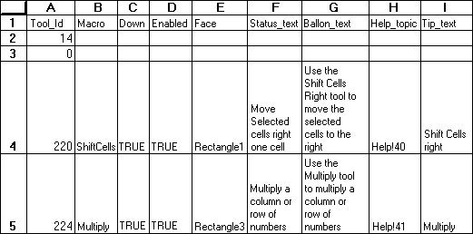

# ADD.TOOL

Adds one or more buttons to a toolbar.

**Syntax**

**ADD.TOOL**(**bar\_id, position, tool\_ref**)

Bar\_id&nbsp;&nbsp;&nbsp;&nbsp;is either a number specifying one of the
built-in toolbars or the name of a custom toolbar.

|             |                      |
| ----------- | -------------------- |
| **Bar\_id** | **Built-in toolbar** |
| 1           | Standard             |
| 2           | Formatting           |
| 3           | Query and Pivot      |
| 4           | Chart                |
| 5           | Drawing              |
| 6           | TipWizard            |
| 7           | Forms                |
| 8           | Stop Recording       |
| 9           | Visual Basic         |
| 10          | Auditing             |
| 11          | WorkGroup            |
| 12          | Microsoft            |
| 13          | Full Screen          |

Position&nbsp;&nbsp;&nbsp;&nbsp;specifies the position of the button
within the toolbar. Position starts with 1 at the left side (if
horizontal) or at the top (if vertical).

Tool\_ref&nbsp;&nbsp;&nbsp;&nbsp;is either a number specifying a
built-in button or a reference to an area on the macro sheet that
defines a custom button or set of buttons (or an array containing this
information).

For customized buttons, the following example shows the components of a
button reference area on a macro sheet and defines custom tools. The
range A1:I5 is a valid tool\_ref. Row 1 refers to a built-in tool. Row 2
defines a gap. For this illustration, values are displayed instead of
formulas so that text can wrap in cells.

  - > Tool\_id is a number associated with the tool. A zero specifies a
    > gap on the toolbar. To specify a custom button, use a name, or a
    > number between 201 and 231.

  - > Macro is the name of, or a quoted R1C1-style reference to, the
    > macro you want to run when the button is clicked.

  - > Down is a logical value specifying the default image of the tool.
    > If down is TRUE, the button appears depressed into the screen; if
    > FALSE or omitted, it appears normal (up).

  - > Enabled is a logical value specifying whether the button can be
    > used. If enabled is TRUE, the button is enabled; if FALSE, it is
    > disabled.

  - > Face specifies a face associated with the tool. Face must be a
    > reference to a picture-type object, for example "Picture 1". If
    > face is omitted, Microsoft Excel uses the default face for the
    > tool.

  - > Status\_text is the text, if any, that you want displayed in the
    > status bar when the button is selected.

  - > Balloon\_text is the balloon help text, if any, associated with
    > the tool. Balloon\_text is available only in Microsoft Excel for
    > the Macintosh using system software version 7.0 or later.

  - > Help\_topics is a reference to a topic in a Help file, in the form
    > "filename\!topic\_number". Help\_topics must be text. If
    > help\_topics is omitted, HELP displays the Contents topic for
    > Microsoft Excel Help.

  - > Tip\_text is the text, if any, that you want displayed as a
    > ToolTip when the mouse pointer moves over a tool button.

To indicate that a particular component of tool\_ref is not used, clear
the contents of the corresponding cell.

**Remarks**

  - > If you do not want to reserve a section of your macro sheet to
    > define the buttons, you can use an array as the tool\_ref argument
    > as shown in the following syntax:

> **ADD.TOOL**(**bar\_id**, position, {**tool\_id1**, macro1, down1,
> enabled1, face1,  
> status\_text1, balloon\_text1, help\_topics1;tool\_id2, macro2, down2,
> enabled2,  
> face2, status\_text2, balloon\_text2, help\_topics2;...})

  - > Picture objects can be created with the camera button or pasted in
    > from another application. In Microsoft Excel for Windows, the
    > graphic object must be either a Windows bitmap or picture object.
    > In Microsoft Excel for the Macintosh, the object must be a picture
    > object.

**Examples**

The following macro formula adds a button to Toolbar5. The cell range
B6:I6 contains tool\_ref.

ADD.TOOL("Toolbar5", 6, B6:I6)

The following macro formula adds the New Macro Sheet button to the fifth
position on the Standard toolbar:

ADD.TOOL(1, 5, 6)

**Related Functions**

[ADD.COMMAND](ADD.COMMAND.md)&nbsp;&nbsp;&nbsp;Adds a command to a menu

[ADD.TOOLBAR](ADD.TOOLBAR.md)&nbsp;&nbsp;&nbsp;Creates a toolbar with the specified tools

[DELETE.TOOL](DELETE.TOOL.md)&nbsp;&nbsp;&nbsp;Deletes a button from a toolbar

[DELETE.TOOLBAR](DELETE.TOOLBAR.md)&nbsp;&nbsp;&nbsp;Deletes custom toolbars

[RESET.TOOLBAR](RESET.TOOLBAR.md)&nbsp;&nbsp;&nbsp;Resets a built-in toolbar to its default
initial setting

Return to [README](README.md#A)

# ADD.TOOL

Adds one or more buttons to a toolbar.

**Syntax**

**ADD.TOOL**(**bar\_id, position, tool\_ref**)

Bar\_id&nbsp;&nbsp;&nbsp;&nbsp;is either a number specifying one of the
built-in toolbars or the name of a custom toolbar.

|             |                      |
| ----------- | -------------------- |
| **Bar\_id** | **Built-in toolbar** |
| 1           | Standard             |
| 2           | Formatting           |
| 3           | Query and Pivot      |
| 4           | Chart                |
| 5           | Drawing              |
| 6           | TipWizard            |
| 7           | Forms                |
| 8           | Stop Recording       |
| 9           | Visual Basic         |
| 10          | Auditing             |
| 11          | WorkGroup            |
| 12          | Microsoft            |
| 13          | Full Screen          |

Position&nbsp;&nbsp;&nbsp;&nbsp;specifies the position of the button
within the toolbar. Position starts with 1 at the left side (if
horizontal) or at the top (if vertical).

Tool\_ref&nbsp;&nbsp;&nbsp;&nbsp;is either a number specifying a
built-in button or a reference to an area on the macro sheet that
defines a custom button or set of buttons (or an array containing this
information).

For customized buttons, the following example shows the components of a
button reference area on a macro sheet and defines custom tools. The
range A1:I5 is a valid tool\_ref. Row 1 refers to a built-in tool. Row 2
defines a gap. For this illustration, values are displayed instead of
formulas so that text can wrap in cells.

  - > Tool\_id is a number associated with the tool. A zero specifies a
    > gap on the toolbar. To specify a custom button, use a name, or a
    > number between 201 and 231.

  - > Macro is the name of, or a quoted R1C1-style reference to, the
    > macro you want to run when the button is clicked.

  - > Down is a logical value specifying the default image of the tool.
    > If down is TRUE, the button appears depressed into the screen; if
    > FALSE or omitted, it appears normal (up).

  - > Enabled is a logical value specifying whether the button can be
    > used. If enabled is TRUE, the button is enabled; if FALSE, it is
    > disabled.

  - > Face specifies a face associated with the tool. Face must be a
    > reference to a picture-type object, for example "Picture 1". If
    > face is omitted, Microsoft Excel uses the default face for the
    > tool.

  - > Status\_text is the text, if any, that you want displayed in the
    > status bar when the button is selected.

  - > Balloon\_text is the balloon help text, if any, associated with
    > the tool. Balloon\_text is available only in Microsoft Excel for
    > the Macintosh using system software version 7.0 or later.

  - > Help\_topics is a reference to a topic in a Help file, in the form
    > "filename\!topic\_number". Help\_topics must be text. If
    > help\_topics is omitted, HELP displays the Contents topic for
    > Microsoft Excel Help.

  - > Tip\_text is the text, if any, that you want displayed as a
    > ToolTip when the mouse pointer moves over a tool button.

To indicate that a particular component of tool\_ref is not used, clear
the contents of the corresponding cell.

**Remarks**

  - > If you do not want to reserve a section of your macro sheet to
    > define the buttons, you can use an array as the tool\_ref argument
    > as shown in the following syntax:

> **ADD.TOOL**(**bar\_id**, position, {**tool\_id1**, macro1, down1,
> enabled1, face1,  
> status\_text1, balloon\_text1, help\_topics1;tool\_id2, macro2, down2,
> enabled2,  
> face2, status\_text2, balloon\_text2, help\_topics2;...})

  - > Picture objects can be created with the camera button or pasted in
    > from another application. In Microsoft Excel for Windows, the
    > graphic object must be either a Windows bitmap or picture object.
    > In Microsoft Excel for the Macintosh, the object must be a picture
    > object.

**Examples**

The following macro formula adds a button to Toolbar5. The cell range
B6:I6 contains tool\_ref.

ADD.TOOL("Toolbar5", 6, B6:I6)

The following macro formula adds the New Macro Sheet button to the fifth
position on the Standard toolbar:

ADD.TOOL(1, 5, 6)

**Related Functions**

[ADD.COMMAND](ADD.COMMAND.md)&nbsp;&nbsp;&nbsp;Adds a command to a menu

[ADD.TOOLBAR](ADD.TOOLBAR.md)&nbsp;&nbsp;&nbsp;Creates a toolbar with the specified tools

[DELETE.TOOL](DELETE.TOOL.md)&nbsp;&nbsp;&nbsp;Deletes a button from a toolbar

[DELETE.TOOLBAR](DELETE.TOOLBAR.md)&nbsp;&nbsp;&nbsp;Deletes custom toolbars

[RESET.TOOLBAR](RESET.TOOLBAR.md)&nbsp;&nbsp;&nbsp;Resets a built-in toolbar to its default
initial setting

Return to [README](README.md#A)

# ADD.TOOL

Adds one or more buttons to a toolbar.

**Syntax**

**ADD.TOOL**(**bar\_id, position, tool\_ref**)

Bar\_id&nbsp;&nbsp;&nbsp;&nbsp;is either a number specifying one of the
built-in toolbars or the name of a custom toolbar.

|             |                      |
| ----------- | -------------------- |
| **Bar\_id** | **Built-in toolbar** |
| 1           | Standard             |
| 2           | Formatting           |
| 3           | Query and Pivot      |
| 4           | Chart                |
| 5           | Drawing              |
| 6           | TipWizard            |
| 7           | Forms                |
| 8           | Stop Recording       |
| 9           | Visual Basic         |
| 10          | Auditing             |
| 11          | WorkGroup            |
| 12          | Microsoft            |
| 13          | Full Screen          |

Position&nbsp;&nbsp;&nbsp;&nbsp;specifies the position of the button
within the toolbar. Position starts with 1 at the left side (if
horizontal) or at the top (if vertical).

Tool\_ref&nbsp;&nbsp;&nbsp;&nbsp;is either a number specifying a
built-in button or a reference to an area on the macro sheet that
defines a custom button or set of buttons (or an array containing this
information).

For customized buttons, the following example shows the components of a
button reference area on a macro sheet and defines custom tools. The
range A1:I5 is a valid tool\_ref. Row 1 refers to a built-in tool. Row 2
defines a gap. For this illustration, values are displayed instead of
formulas so that text can wrap in cells.

  - > Tool\_id is a number associated with the tool. A zero specifies a
    > gap on the toolbar. To specify a custom button, use a name, or a
    > number between 201 and 231.

  - > Macro is the name of, or a quoted R1C1-style reference to, the
    > macro you want to run when the button is clicked.

  - > Down is a logical value specifying the default image of the tool.
    > If down is TRUE, the button appears depressed into the screen; if
    > FALSE or omitted, it appears normal (up).

  - > Enabled is a logical value specifying whether the button can be
    > used. If enabled is TRUE, the button is enabled; if FALSE, it is
    > disabled.

  - > Face specifies a face associated with the tool. Face must be a
    > reference to a picture-type object, for example "Picture 1". If
    > face is omitted, Microsoft Excel uses the default face for the
    > tool.

  - > Status\_text is the text, if any, that you want displayed in the
    > status bar when the button is selected.

  - > Balloon\_text is the balloon help text, if any, associated with
    > the tool. Balloon\_text is available only in Microsoft Excel for
    > the Macintosh using system software version 7.0 or later.

  - > Help\_topics is a reference to a topic in a Help file, in the form
    > "filename\!topic\_number". Help\_topics must be text. If
    > help\_topics is omitted, HELP displays the Contents topic for
    > Microsoft Excel Help.

  - > Tip\_text is the text, if any, that you want displayed as a
    > ToolTip when the mouse pointer moves over a tool button.

To indicate that a particular component of tool\_ref is not used, clear
the contents of the corresponding cell.

**Remarks**

  - > If you do not want to reserve a section of your macro sheet to
    > define the buttons, you can use an array as the tool\_ref argument
    > as shown in the following syntax:

> **ADD.TOOL**(**bar\_id**, position, {**tool\_id1**, macro1, down1,
> enabled1, face1,  
> status\_text1, balloon\_text1, help\_topics1;tool\_id2, macro2, down2,
> enabled2,  
> face2, status\_text2, balloon\_text2, help\_topics2;...})

  - > Picture objects can be created with the camera button or pasted in
    > from another application. In Microsoft Excel for Windows, the
    > graphic object must be either a Windows bitmap or picture object.
    > In Microsoft Excel for the Macintosh, the object must be a picture
    > object.

**Examples**

The following macro formula adds a button to Toolbar5. The cell range
B6:I6 contains tool\_ref.

ADD.TOOL("Toolbar5", 6, B6:I6)

The following macro formula adds the New Macro Sheet button to the fifth
position on the Standard toolbar:

ADD.TOOL(1, 5, 6)

**Related Functions**

[ADD.COMMAND](ADD.COMMAND.md)&nbsp;&nbsp;&nbsp;Adds a command to a menu

[ADD.TOOLBAR](ADD.TOOLBAR.md)&nbsp;&nbsp;&nbsp;Creates a toolbar with the specified tools

[DELETE.TOOL](DELETE.TOOL.md)&nbsp;&nbsp;&nbsp;Deletes a button from a toolbar

[DELETE.TOOLBAR](DELETE.TOOLBAR.md)&nbsp;&nbsp;&nbsp;Deletes custom toolbars

[RESET.TOOLBAR](RESET.TOOLBAR.md)&nbsp;&nbsp;&nbsp;Resets a built-in toolbar to its default
initial setting

Return to [README](README.md#A)

