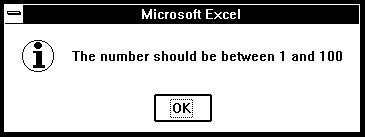
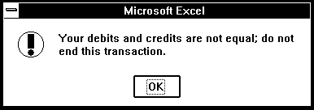

ALERT

Displays a dialog box and message and waits for you to click a button.
Use ALERT instead of MESSAGE if you want to interrupt the flow of a
macro and force the user to make a choice or to notice an important
message.

**Syntax**

**ALERT**(message\_text, type\_num, help\_ref)

Message\_text**&nbsp;&nbsp;&nbsp;nbsp;&nbsp;&nbsp;&nbsp;nbsp;&nbsp;&nbsp;&nbsp;nbsp;&nbsp;is the message displayed in the
dialog box.

Type\_num**&nbsp;&nbsp;&nbsp;nbsp;&nbsp;&nbsp;&nbsp;nbsp;&nbsp;&nbsp;&nbsp;nbsp;&nbsp;is a number from 1 to 3 specifying
which type of dialog box to display. If you omit type\_num, it is
assumed to be 2.

  - > If type\_num is 1, ALERT displays a dialog box containing the OK
    > and Cancel buttons. Click a button to continue or cancel an
    > action. ALERT returns TRUE if you click the OK button and FALSE if
    > you click the Cancel button. See the last example below.

  - > If type\_num is 2 or 3, ALERT displays a dialog box containing an
    > OK button. Click the button to continue, and ALERT returns TRUE.
    > The only difference between specifying 2 or 3 is that ALERT
    > displays a different icon on the left side of the dialog box as
    > shown in the examples below. So, for example, you could use 2 for
    > notes or to present general information, and 3 for errors or
    > warnings.

Help\_ref**&nbsp;&nbsp;&nbsp;nbsp;&nbsp;&nbsp;&nbsp;nbsp;&nbsp;&nbsp;&nbsp;nbsp;&nbsp;is a reference to a custom online Help
topic, in the form "filename\! topic\_number".

  - > If help\_ref is present, a Help button appears in the lower-right
    > corner of the alert message. Clicking the Help button starts Help
    > and displays the specified topic.

  - > If help\_ref is omitted, no Help button appears.

  - > Help\_ref must be given in text form.

**Note**&nbsp;&nbsp;&nbsp;nbsp;&nbsp;&nbsp;&nbsp;nbsp;&nbsp;&nbsp;&nbsp;nbsp;**In Microsoft Excel for the Macintosh, the
ALERT dialog box is not a movable window.

**Examples**

The following dialog boxes show the results of using ALERT with
type\_num 1, 2, and 3. The first and fourth examples include a Help
button.

In Microsoft Excel for Windows, the following macro formulas display
these three dialog boxes.

ALERT("Are you sure you want to delete this item?", 1,
"CUSTHELP.HLP\!101")

ALERT("The number should be between 1 and 100", 2)

ALERT("Your debits and credits are not equal; do not end this
transaction.", 3)

In Microsoft Excel for the Macintosh, the following macro formulas
display these three dialog boxes.

ALERT("Are you sure you want to delete this item?", 1, "'Custom
Help'\!101")

ALERT("The number should be between 1 and 100", 2)

ALERT("Your debits and credits are not equal; do not end this
transaction.", 3)

A common use of the ALERT function is to give the user a choice of two
actions. The following macro formula in an Auto\_Open macro asks which
reference style to use when the workbook is opened.

A1.R1C1(ALERT("Click OK for A1 style; Cancel for R1C1", 1))

**Related Functions**

[INPUT](INPUT.md)**&nbsp;&nbsp;&nbsp;nbsp;&nbsp;&nbsp;&nbsp;nbsp;&nbsp;&nbsp;&nbsp;nbsp;Displays a dialog box for user input

[MESSAGE](MESSAGE.md)**&nbsp;&nbsp;&nbsp;nbsp;&nbsp;&nbsp;&nbsp;nbsp;&nbsp;&nbsp;&nbsp;nbsp;Displays a message in the status bar

Return to [README](README.md)

