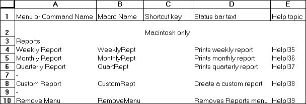

REQUEST

Requests an array of a specific type of information from an application
with which you have a dynamic data exchange (DDE) link. Use REQUEST with
other Microsoft Excel DDE functions to move information from another
application into Microsoft Excel.

**Syntax**

**REQUEST**(**channel\_num, item\_text**)

**Important**   Microsoft Excel for the Macintosh requires system
software version 7.0 or later for this function.

Channel\_num    is a number returned by a previously run INITIATE
function. Channel\_num refers to a channel through which Microsoft Excel
communicates with another program.

Item\_text    is a code indicating the type of information you want to
request from another application. The form of item\_text depends on the
application connected to channel\_num.

REQUEST returns the data as an array. For example, suppose the remote
data to be returned came from a sheet that looked like the following
illustration.

REQUEST would return that data as the following array:

{1, 2, 3;4, 5, 6}

If REQUEST is not successful, it returns the following error values.

<table>
<tbody>
<tr class="odd">
<td><blockquote>

<strong>Value returned</strong>

</blockquote></td>
<td><blockquote>

<strong>Situation</strong>

</blockquote></td>
</tr>
<tr class="even">
<td><blockquote>

#VALUE!

</blockquote></td>
<td><blockquote>

Channel_num is not a valid channel number.

</blockquote></td>
</tr>
<tr class="odd">
<td><blockquote>

#N/A

</blockquote></td>
<td><blockquote>

The application you are accessing is busy doing something else.

</blockquote></td>
</tr>
<tr class="even">
<td><blockquote>

#DIV/0!

</blockquote></td>
<td><blockquote>

The application you are accessing does not respond after a certain length of time, or you have pressed ESC or COMMAND+PERIOD to cancel.

</blockquote></td>
</tr>
<tr class="odd">
<td><blockquote>

#REF!

</blockquote></td>
<td><blockquote>

The request is refused.

</blockquote></td>
</tr>
</tbody>
</table>

**Tip   **Use the ERROR.TYPE function to distinguish between the
different error values.

**Example**

Suppose you had opened a DDE channel to Microsoft Word for Windows.
WChan contains the number of the open channel. In Microsoft Excel for
Windows, the following function returns the text specified by the
bookmark named BMK1.

\=REQUEST(WChan, "BMK1")

**Related Functions**

[EXECUTE](EXECUTE.md)   Carries out a command in another application

[INITIATE](INITIATE.md)   Opens a channel to another application

[POKE](POKE.md)   Sends data to another application

[SEND.KEYS](SEND.KEYS.md)   Sends a key sequence to another application

[TERMINATE](TERMINATE.md)   Closes a dynamic data exchange (DDE) channel previously
opened with the INITIATE function

Return to [README](README.md)

