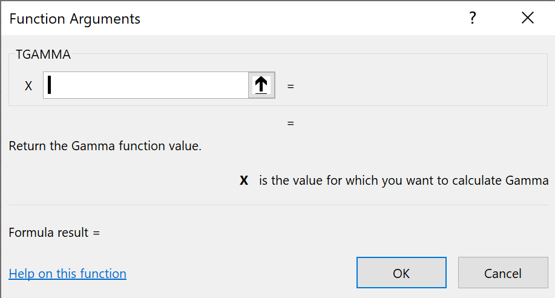

% Embed C++ in Excel
% Keith A. Lewis

# Rationale

C++ is an algorithmic language. You see the code but not the data.

Excel is purely functional. You see the data but not the code.

C++ and Excel are complementary.

The [xll library](https://github.com/xlladdins/xll) makes C++ code accessible to anyone using Excel on Windows.

# [xlladdins.com](https://xlladdins.com)

- Call C++/C/Fortran from Excel
- Copy, paste, insert graphs: a debugger on steroids
- Use UTF-8 strings
- Embed objects and use single inheritance
- Plug in 3rd party libraries
- Integrate with Excel help documentation

# AddIn

Specify the information Excel needs to call your function.

``` C++
#include "xll/xll.h"
using namespace xll;

AddIn xai_tgamma(
    Function(XLL_DOUBLE, "xll_tgamma", "TGAMMA")
    .Arguments({
        Arg(XLL_DOUBLE, "x", "is the value for which you want to calculate Gamma.")
    })
    .FunctionHelp("Return the Gamma function value.")
    .Category("MATH")
    .HelpTopic("https://docs.microsoft.com/en-us/cpp/c-runtime-library/reference/tgamma-tgammaf-tgammal")
);
```

This shows up in the `MATH` category of the function wizard as:



Click [Help on this function](https://docs.microsoft.com/en-us/cpp/c-runtime-library/reference/tgamma-tgammaf-tgammal)
to open the help topic URL in a browser.

Implement `xll_tgamma`

```C++
#include <cmath> // for double tgamma(double)

double WINAPI xll_tgamma(double x)
{
#pragma XLLEXPORT
	return tgamma(x);
}
```

Use `WINAPI` for functions called by Excel if you don't like debugging corrupt call stack crashes.

Export `xll_tgamma` from the dll with `#pragma XLLEXPORT`. 
If you forget you will get a warning when the add-in is opened.

# Macros

Macros take no arguments, they only produce side effects.

```C++
// Alt-F8, XLL.MACRO calls xll_macro
AddIn xai_macro(Macro("xll_macro", "XLL.MACRO"));
int WINAPI xll_macro(void)
{
#pragma XLLEXPORT
    Excel(xlcAlert, 
        Excel(xlfConcatenate,
            OPER("XLL.MACRO 召唤 with активный  cell: "), // use utf-8
            Excel(xlfReftext, 
                Excel(xlfActiveCell), 
                OPER(true) // A1 style instead of R1C1
            )
        ),
        OPER(2), // general information
        OPER("https://xlladdins.github.io/Excel4Macros/alert.html")
    );
	
    return TRUE;
}
```
`Excel(xlfFunction, args, ...)` calls the Excel <b>f</b>unction `=FUNCTION(args, ...)`.

`Excel(xlcMacro, args, ...)` executes the <b>m</b>acro `MACRO(args, ...)`. This can only
be used from macros, not functions.
Consult the [Excel4Macros](https://xlladdins.github.io/Excel4Macros/)
documentation to discern the appropriate arguments.

# `OPER`

An `OPER` is a class that corresponds to an Excel cell. 
It can be a number, string, error, boolean, ..., or a 2-dimensional range of cells.

It is a variant that satisfies the [`std::regular`](https://en.cppreference.com/w/cpp/concepts/regular) concept.
`OPER o(1.23)` is the number `1.23`. 
Assigning a string, `o = "foo"`, or boolean, `o = true`, turns it into a string or boolean. 
The `xltype` member of `OPER` indicates the type defined in
[Microsoft Excel SDK header file](https://github.com/xlladdins/xll/blob/master/xll/XLCALL.H)
as `xltypeNum`, `xltypeStr`, `xltypeErr, xltypeBool`, ..., `xltypeMulti`.

Excel is [Postel](https://devopedia.org/postel-s-law) in what arguments it accepts
from functions. Any `XLL_`_`TYPE`_ can be used to leverage Excel
type checking. If there is an argument type mismatch `#VALUE!` will be returned
by Excel before the function is called.

!!! link to XLL_TYPE

# `xll::handle`

A `xll::handle<T>` has a pointer to an object of type `T` and behaves like `std::unique_ptr<T>`.
The constructor `xll::handle<T> h(new T(args...))` stores the pointer returned by `new`.
It refers to exactly one object and calls `delete` on the object when it goes out of scope.
Its `ptr()` and arrow `operator->()` member functions return the pointer to the object.
Use the `get()` member function to return a `HANDLEX` value that can be used in Excel.

# `HANDLEX`

A `HANDLEX` is a 64-bit IEEE double. Its bits are the same bits as the pointer.
Converting a `HANDLEX` to a pointer and back is a cast
that only takes a few machine instructions instead of a lookup in an associative array.
On 64-bit Windows 10 the first 16-bits of a pointer are zero so we only need the remaining 48-bits.
Doubles can exactly represent integers less than 2<sup>53</sup> so there is plenty of room to spare.

The constructor `xll::handle<T>(HANDLEX)` converts a `HANDLEX` to a pointer.
If the `HANDLEX` was not created by a prior call to `xll::handle<T>(T*)` a null pointer is returned.
Use `explicit xll::handle<T>::operator bool() const` to detect that.

# Example

Generic C++ class holding a regular type.

```C++
// base.h
#include <concepts>

template<std::regular T>
class base {
	T t;
public:
	base()
	{ }
	base(const T& t) 
		: t(t) 
	{ }
	virtual ~base() 
	{ }
	T get() const
	{
		return t; 
	}
};
```

Embed `base<OPER>` in Excel.

```C++
// xll_base.cpp
#include "base.h"
#include "xll/xll.h"

using namespace xll;

AddIn xai_base(
	Function(XLL_HANDLEX, "xll_base", "\\XLL.BASE")
	.Arguments({
		Arg(XLL_LPOPER, "cell", "is a cell."))
	})
	.Uncalced() // \XLL.BASE has a side effect
);
HANDLEX WINAPI xll_base(LPOPER po)
{
#pragma XLLEXPORT
	handle<base<OPER>> h(new base(*po));
	
	return h.get();
}
```

A `LPOPER` is a pointer to an `OPER`.

Call a member function.

```C++
AddIn xai_base_get(
	Function(XLL_LPOPER, "xll_base_get", "XLL.BASE.GET")
	.Arguments({
		Arg(XLL_HANDLEX, "handle", "is a handle to a base<OPER> object."))
	})
);
LPOPER WINAPI xll_base_get(HANDLEX h)
{
#pragma XLLEXPORT
	handle<base<OPER>> h_(h);
	
	return h_ ? &h_->get() : (LPOPER)ErrValue; 
}
```

Arguments and return values using `OPER`s are passed as pointers.
Note `h.get()` returns the `HANDLEX` that `h_->get()` uses to call the member function.
If the handle did not come from a previous call to `\XLL.BASE` then `#VALUE!`
is returned. Returning the address of `h_->get()` assumes the handle lives
beyond the function return.

# Single inheritence

When creating a handle to an object `U` that is derived from `T`
use `xll::handle<T> h(new U(args...))` and return the `HANDLEX` with `h.get()`.
The handle can be used to call any member function of `T`.
To call member functions of `U` use `dynamic_cast`.
The convenience function `xll::handle<T>::as<U>()` does the dynamic cast for you.

```C++
// derived.h
#include "base.h"

template<std::regular T>
class derived : public base<T> {
	T t2;
public:
	derived()
	{ }
	derived(const T& t, const T& t2) 
		: base<T>(t), t2(t2)
	{ }
	~derived() 
	{ }
	T get2() const
	{
		return t2; 
	}
};
```
```C++
// xll_derived.cpp
#include "derived.h"
#include "xll/xll.h"

using namespace xll;

AddIn xai_derived(
	Function(XLL_HANDLEX, "xll_derived", "\\XLL.DERIVED")
	.Arguments({
		Arg(XLL_LPOPER, "cell", "is a cell passed to base<OPER>. ))
		Arg(XLL_LPOPER, "cell2", "is a cell passed to derived<OPER>."))
	})
	.Uncalced() // \XLL.DERIVED has a side effect
);
HANDLEX WINAPI xll_derived(LPOPER po, LPOPER po2)
{
#pragma XLLEXPORT
	handle<base<OPER>> h(new derived<OPER>(*po, *po2));
	
	return h.get();
}

AddIn xai_derived_get2(
	Function(XLL_LPOPER, "xll_derived_get2, "XLL.DERIVED.GET2")
	.Arguments({
		Arg(XLL_HANDLEX, "handle", "is a handle to a derived<OPER> object."))
	})
);
LPOPER WINAPI xll_derived_get2(HANDLEX h)
{
#pragma XLLEXPORT
	handle<base<OPER>> h_(h);
	if (!h_) {
		return (LPOPER)ErrNA; // #N/A
	}

	auto h2 = h_.as<derived<OPER>>();
	
	return h2 ? h2->get2() : (LPOPER)ErrValue;
}
```

Now you know how to embed C++ in Excel and use single inheritance.

# Calling `delete`

Excel add-ins dealing with C++ objects typically have an "object manager" that
implements a garbage collector. The `xll::handle` class uses the cell containing
the handle to do garbage collection.

The `xll::handle` class will call
`delete` on objects created by `xll::handle<T>(T*)` when called from a cell
containing a `HANDLEX` from a previous call. The constructor is being provided
with new arguments so the old object is no longer required.

Moving, copying, and pasting cells containing handles will not leak. If you are
dead set on leaking memory then create a handle in a cell and delete it.

If a function that creates a handle is used as an argument to another function
then there is no cell containing a handle that can be used to call delete.
The `xll::handle(T*)` constructor keeps track of these temporary handles. 
The outer calling function can use them, and make a copy if necessary, but they
are deleted when the outer function exits.

__Exercise__. _Figure out how `XLL.BASE.GET` can leak_.

_Hint_. See [`handle.cpp`](https://github.com/xlladdins/xll/blob/master/test/handle.cpp).


# Calling `new`

The flip side is when you save a spreadsheet with handles.
When opened in a new Excel session the handles need to be refreshed. 
Use `Ctrl-Alt-F9` to call `new` on all the handles. 
This can also be used for garbage collection in case you deleted
a cell immediately after creating a handle.

## Remarks

It only takes a couple of lines of code to call functions or embed C++ objects in Excel
using the xll add-in library. Tell Excel what to return, the C++ function to call, and the
name you want Excel to use. Specify the arguments the function takes and how you
want them to show up in the Function Wizard. 

The `WINAPI` function called by Excel should be a thin wrapper that
massages the Excel data type arguments to what you need to pass to
the platform-independent code, then fluff return values back to what Excel wants.
Specifying `.Category`, `.FunctionHelp`, and `.HelpTopic` are optional.

Once you do this all of the functionality of Excel is available to you.
You can copy and paste to your heart's content and insert graphs
to ~~break things~~ get a better picture of data returned by your code.

The latest version of Excel has 
[dynamic arrays](https://insider.office.com/en-us/blog/dynamic-arrays-and-new-functions-in-excel).
No more selecting a guess at the output range, `F2` and `Ctrl-Shift-Enter`, then `Ctrl-Z` to back off.
The entire array is plopped into Excel as the return value.
Use `A1#` to refer to it in function calls, where `A1` is the upper left corner of the array.
Excel will pass the current size of the dynamic array to your function.

As Bjarne said, "There are two kinds of languages..." 
Complaining about Excel does not change the number of people who use that as a
tool to get their work done.
The xll library makes it easy to deliver a self contained add-in to anyone using Excel on Windows.
If you have the quality problem of people actually using the code you write it is possible
to provide more detailed [documentation](https://github.com/xlladdins/xll/blob/master/README.md#documentation).
Spend your precious time explaining it once in a form you can point your customers to, then get back to
writing cool stuff that even more people might want to use.
